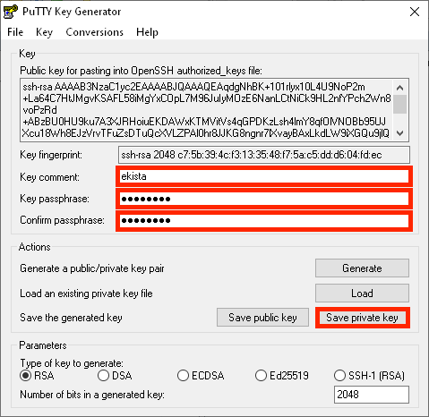
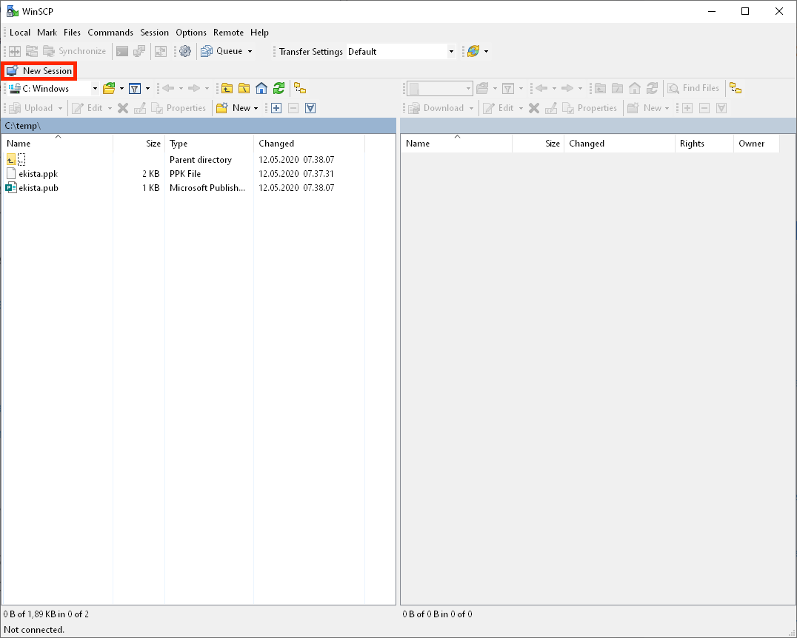
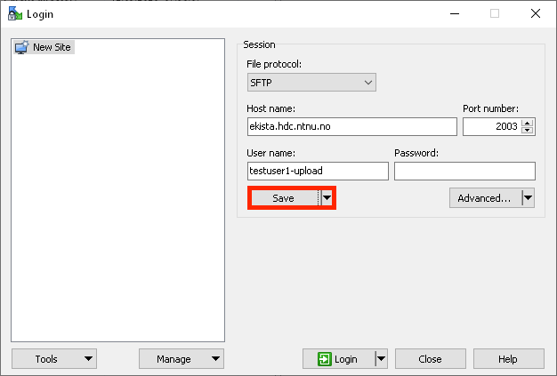
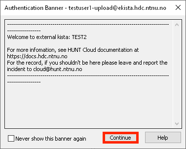

# External kista

External kistas support labs with a simple and secure way to transport data from an external user located outside HUNT Cloud and into their lab in HUNT Cloud. In short, external kistas are short-lived and hardened [SFTP](https://en.wikipedia.org/wiki/SSH_File_Transfer_Protocol) servers that are dedicated to one specific data transaction of data transport.

## For external users

::: tip Note
This section aims to give a technical description on how external users outside HUNT Cloud can connect and transfer data to our hosted SFTP service (external kista). See our [transfer section](/faq/transfer/) in the FAQ for more information on the service itself.
:::

As an external user outside HUNT Cloud, you will need to meet three technical requirements to import data to a dedicated external kista. 

- [SSH key pair](#ssh-key-pair)
- [SFTP client](#sftp-client)
- [Network connection to HUNT Cloud](#network-traffic)

### SSH key pair

You will use a SSH public key to authenticate and access your kista (instead of passwords). Before we can deploy the kista, you must therefore provide us with a public key from a SSH key pair. This section describes how to do this. 

#### Key types 

We accept the following public key types:

- **`RSA`**
- **`ECDSA`**
- **`Ed25519`**

#### Generate a SSH key pair

We recommend that you create a dedicated SSH key pair for each kista transfer. Click on the section below for a step wise guide on how to generate a new key pair in Windows that you can use for your kista access.

::: details How to generate a RSA SSH key pair on Windows with WinSCP

[WinSCP](https://winscp.net/) is an open source data transfer client for Windows that we recommend for SFTP transfers. Download WinSCP from [winscp.net](https://winscp.net/eng/download.php) and install the software. Follow these steps to generate a RSA SSH key pair: 

1. In **`WinSCP`**:
   - Click **`New Session`**
   - Click **`Tools`**
   - Click **`Run PuTTYgen`**

2. In **`PuTTY Key Generator`**:
   - Click **`Generate`** to generate a new RSA key pair.

3. In **`PuTTY Key Generator`**:
   - Enter **`ekista`** in **`Key comment`**
   - Enter a passphrase in **`Key passphrase`**
   - Enter the same passphrase in **`Confirm passphrase`**
   - Note. You will use this passphrase when you use the SSH key during the kista connection, so please make sure to remember it or store it in a suitable password manager.
   - Click **`Save private key`**

4. In **`Save private key as`** window:
   - Select a place to store the private key
   - Enter **`ekista`** as the filename
   - Click **`Save`**

5. In **`PuTTY Key Generator`**:
   - Click **`Save public key`**

6. In **`Save public key as`** window:
   - Select a place to store the public key
   - Enter **`ekista.pub`** as the filename
   - Click **`Save`**

You should now have a SSH key pair consisting of the following files:

- The private key **`ekista.ppk`**
- The public key **`ekista.pub`**

7. Forward the public key named **`ekista.pub`** to us on email ([Contact information](/contact)). The public key is used for encryption only and can be sent in clear text.

  :::

### SFTP client

You will need a SFTP client to connect and transfer data to the external kista. In addition you will need the external kista transfer information to be able to connect. This will be forwarded by HUNT Cloud on the time of deployment.

::: warning Requirements
You will need your external kista transfer information forwarded by HUNT Cloud to complete this step. This information includes: 
- **`Host name`**
- **`Port number`**
- **`User name`**
:::

Below is a guide on how to connect using the WinSCP SFTP client on Windows. 

::: details How to connect to an external kista on Windows with WinSCP

1. In **`WinSCP`**:
   - Click **`New Session`**

2. In the **`Login`** window:
   - Enter **`ekista.hdc.ntnu.no`** as **`Host name`**
   - Enter the port number from the transfer information as **`Port number`** (the number in the example will not work).
   - Enter the user name from the transfer information as **`User name`** (the name in the example will not work).
   - Click **`Advanced`**

3. In the **`Advanced Site Settings`** window:
   - Select the **`Authentication`** page in the sidebar
   - Uncheck the **`Attempt 'keyboard-interactive' authentication`** checkbox
   - Enter the location of the **`Private key file`**. If you followed the previous guide, then this should be the location of the **`ekista.ppk`** private key file.
   - Click **`OK`**

4. In the **`Login`** window:
   - Click **`Save`**

5. In the **`Save session as site`** window:
   - Choose a **`Site name`** if required, combining the **`User name`** and **`Host name`** (the site name given in the example will not work).
   - Click **`OK`**

6. In the **`Login`** window:
   - Click **`Login`**

7. In the **`Warning`** window:
   - Compare and verify that the appropriate **`SHA-256 key fingerprint`** from the transfer information matches
   - Click **`Yes`**

8. In the **`Authentication Banner`** window:
   - Read the information banner to ensure you are connecting to correct kista
   - Click **`Continue`**

9. In the **`Key passphrase`** window:
   - Enter the passphrase for your private key. If you followed the previous guide, this should be the **`ekista.ppk`** key and passphrase that you set during the generation in the [SSH key pair](#ssh-key) section above.
   - Click **`OK`**

10. In **`WinSCP`**:

- You should now be connect to the SFTP server
- Upload data in the **`upload`** directory

:::

### Network traffic

Successful access to external kistas might require firewall exemptions set by your host organization as traffic will go in and out of your organizational network and to and from HUNT Cloud.

Please use the following network details to ensure that it is possible to connect to external kistas:

- **`IP: 129.241.176.121`**
- **`Port range: 2000-2128`**
- **`Protocol: TCP`**

::: tip Specific port number
You will connect to a specific port number to access the external kista for an individual data transfer. We will send this number in your transfer information after deployment.
:::

Please [contact us](/contact) if you require more details or run into trouble.

## For internal users

Lab users in HUNT Cloud that will download data from an external kista can follow the steps in our [download guide](/data-transfer/internal-kista/#download) for internal kistas.

