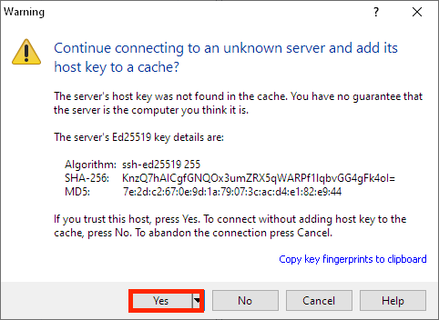
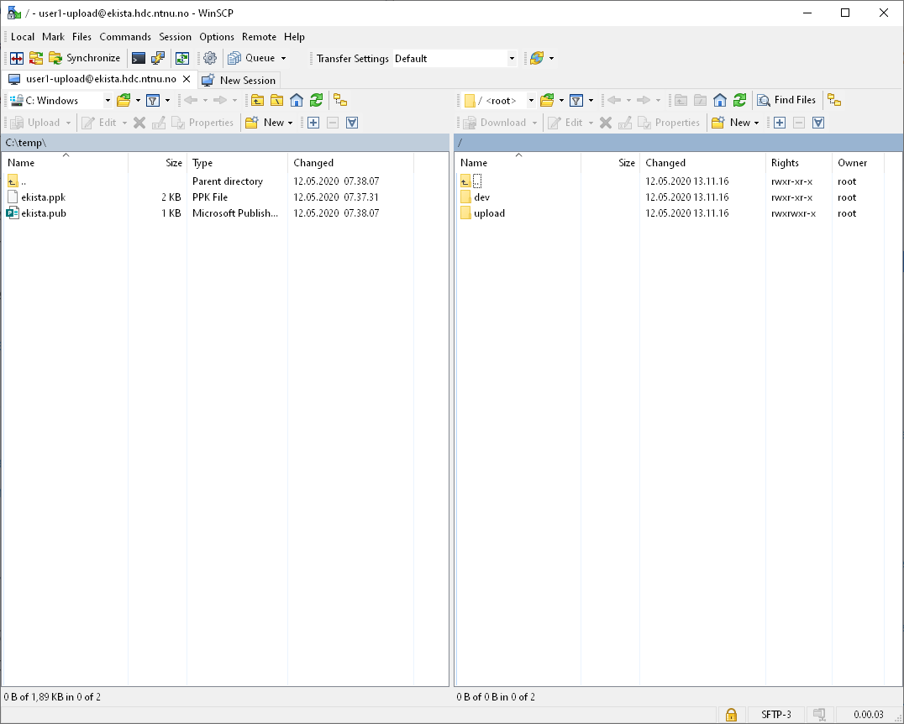

# External kista

External kistas support labs with a simple and secure way to transport data in or out of their lab in HUNT Cloud and to or from an external user located outside HUNT Cloud.
In short, external kistas are short-lived and hardened SFTP servers that are dedicated to one specific data transaction of data transport.

## For external users

### Technical requirements

The following requirements are necessary in order for external users to connect and transfer data to our hosted SFTP service called external kista:

- [SSH key pair](#ssh-key)
- [SFTP client](#sftp-client)
- [Network connection to HUNT Cloud](#network-connection-to-hunt-cloud)

### SSH key pair

The external kistas use SSH public key authentication in order to authenticate users instead of passwords.
This means that the external user must create a SSH key pair and forward the public key so we can authenticate it when external users connect.

We recommend creating a separate SSH key pair for each kista agreement and we accept the following public key types:

- **`RSA`**
- **`ECDSA`**
- **`Ed25519`**

In case external users do not have their own procedures for creating SSH key pairs, we recommend using the guide below:

::: details How to generate a RSA SSH key pair on Windows with WinSCP

[WinSCP](https://winscp.net/) is an open source data transfer client for Windows that we recommend for SFTP transfers. Download WinSCP from [winscp.net](https://winscp.net/eng/download.php) and install the software.

1. In **`WinSCP`**:
   - Click **`New Session`**
   - Click **`Tools`**
   - Click **`Run PuTTYgen`**

2. In **`PuTTY Key Generator`**:
   - Click **`Generate`** to generate a new RSA key pair.

3. In **`PuTTY Key Generator`**:
   - Enter **`ekista`** in **`Key comment`**
   - Enter a passphrase in **`Key passphrase`**
   - Enter the same passphrase in **`Confirm passphrase`**
   - N.B. This passphrase must be entered when using the SSH key so please make sure to remember it or store it in a suitable password manager.
   - Click **`Save private key`**

4. In **`Save private key as`** window:
   - Select a place to store the private key
   - Enter **`ekista`** as the filename
   - Click **`Save`**

5. In **`PuTTY Key Generator`**:
   - Click **`Save public key`**

6. In **`Save public key as`** window:
   - Select a place to store the public key
   - Enter **`ekista.pub`** as the filename
   - Click **`Save`**

You should now have a SSH key pair consisting of the following files:

- The private key **`ekista.ppk`**
- The public key **`ekista.pub`**
  :::

### SFTP client

The external kistas are SFTP servers and therefore require an SFTP client in order to connect and transfer data.

After an external kista is deployed, we will send the necessary transfer information such as:

- **`Host name`**
- **`Port number`**
- **`User name`**

In case external users do not have a SFTP client, we recommend using the guide below:

::: details How to connect to an external kista on Windows with WinSCP

1. In **`WinSCP`**:
   - Click **`New Session`**

2. In the **`Login`** window:
   - Enter **`ekista.hdc.ntnu.no`** as **`Host name`**
   - Enter the port number from the transfer info as **`Port number`**
   - Enter the user name from the transfer info as **`User name`**
   - Click **`Advanced`**

3. In the **`Advanced Site Settings`** window:
   - Select the **`Authentication`** page in the sidebar
   - Uncheck the **`Attempt 'keyboard-interactive' authentication`** checkbox
   - Enter the location of the **`Private key file`**. If you followed the previous guide, then this should be the location of the **`ekista.ppk`** private key file.
   - Click **`OK`**

4. In the **`Login`** window:
   - Click **`Save`**

5. In the **`Save session as site`** window:
   - Choose a **`Site name`** if required
   - Click **`OK`**

6. In the **`Login`** window:
   - Click **`Login`**

7. In the **`Warning`** window:
   - Click **`Yes`**

8. In the **`Authentication Banner`** window:
   - Read the information banner to ensure you are connecting to correct kista
   - Click **`Continue`**

9. In the **`Key passphrase`** window:
   - Enter the passphrase for the private key **`ekista.ppk`**. If you followed the previous guide, then this should be the passphrase that was set during the generation of the SSH key pair.
   - Click **`OK`**

10. In **`WinSCP`**:

- You should now be connect to the SFTP server
- Upload data in the **`upload`** directory

:::

### Network connection to HUNT Cloud

External users might require firewall exemptions in order to communicate with external kistas in HUNT Cloud as it is outside their network.

Please use the following network details to ensure that it is possible to connect to external kistas:

- **`IP: 129.241.176.121`**
- **`Port range: 2000-2128`**
- **`Protocol: TCP`**

::: tip Specific port number
We will send the specific port number in the transfer information after deployment of an external kista
:::

Please [contact us](/contact) if you require more details or if it is impossible to open for this port range.
